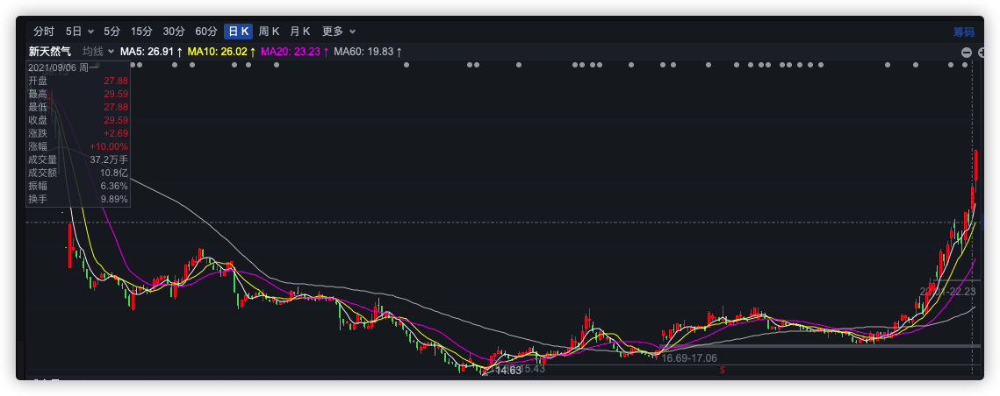
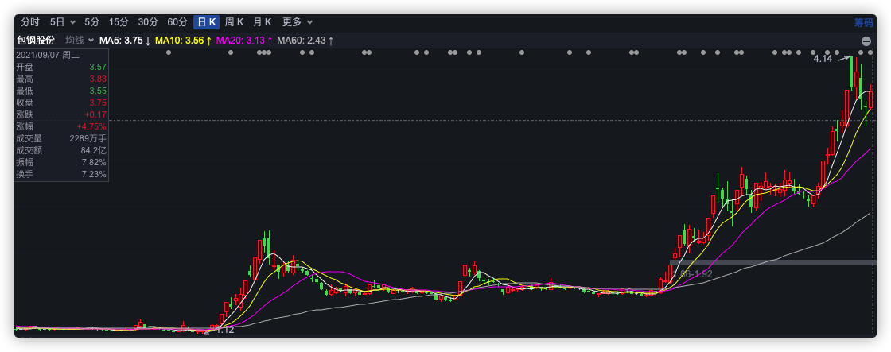
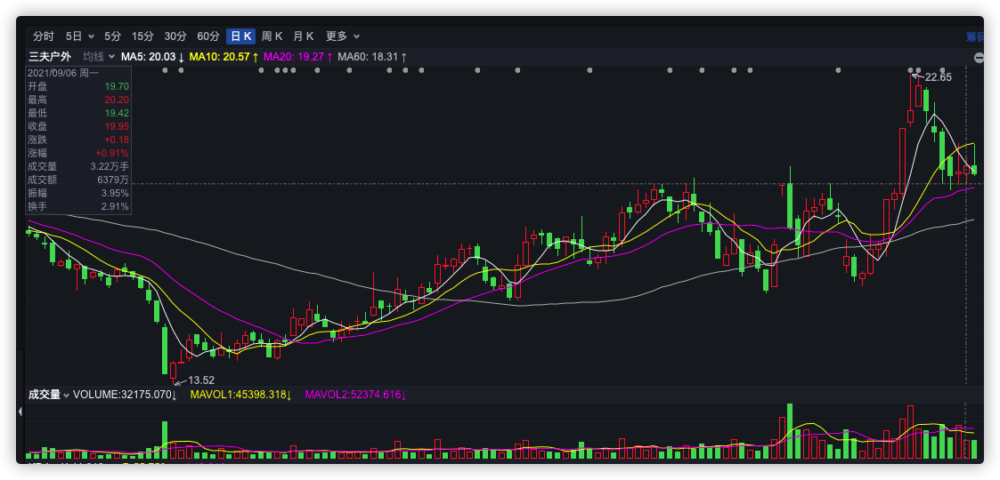

```
/*
 * @Author: zendu 
 * @Date: 2021-09-01 11:03:15 
 * @Last Modified by: zendu
 * @Last Modified time: 2021-09-01 11:17:47
 */
```


```
2021-8/17 南宁糖业
买入理由：
1. 月线级别趋势形成，资金为王，趋势不可违
2. 巴西自然灾害导致糖减产
3. 3～5年一度的糖周期开始初步成型
```

<div align="center"></div>


```
2021-8/31 海格通信
买入理由：
1. 资金趋势明显，先是突破120天均线，后突破250天均线，资金放量
2. 在突破250均线后，开始筑平台大概2周
3. 和中航沈飞｜南宁糖业启动信号类似，选择买入
4. 通信+军工 没有炒作方向，看不清未来的趋势
5. 顺周期 + 科技涨的太高了，小盘低估值可能会补涨（机构不买高位，自然流向低位）
```


<div align="center"></div>


```
2021-9/6 新天然气
买入理由：
1. 天然气供不应求，俄罗斯限制出口
2. 天然气是清洁能源，符合国家发展策略
3. 即将到来的冬天会迎来天然气周期
4. 新天然气相对其他天然气股较为强势
```

<div align="center"></div>


```
2021-9/7 包钢股份
买入理由：
1. 目前大盘处于主升浪，想买点能和大盘共振的
2. 得资源者得天下
3. 钢铁走势不如煤炭疯狂，同时比有色稍强 
```

<div align="center"></div>


```
2021-9/6 三夫户外
买入理由：
1. 国家政策方向
2. 处于底部位置
```


<div align="center"></div>
