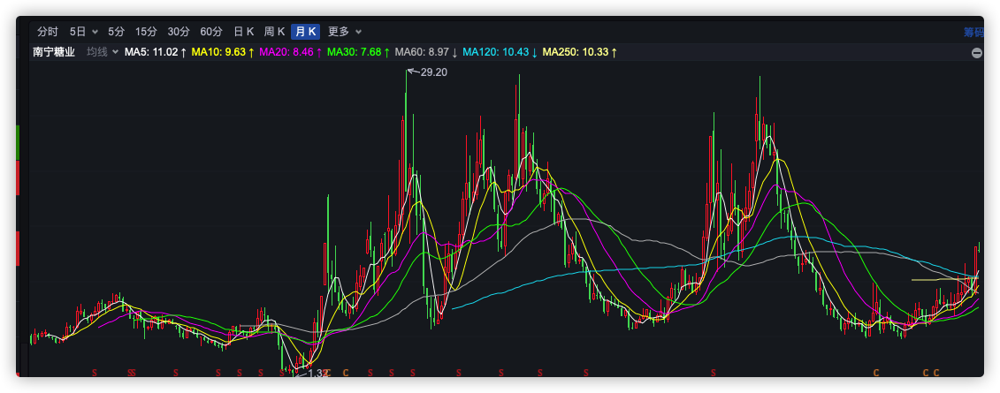
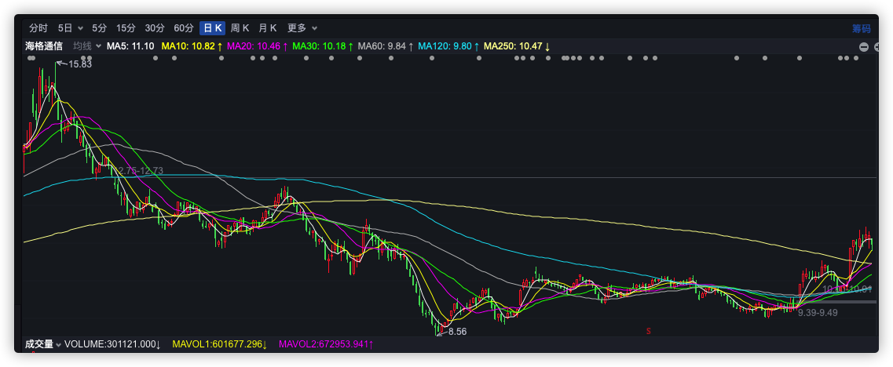

```
/*
 * @Author: zendu 
 * @Date: 2021-09-01 11:03:15 
 * @Last Modified by: zendu
 * @Last Modified time: 2021-09-01 11:17:47
 */
```


```
2021-8/17 买入南宁糖业
买入理由：
1. 月线级别趋势形成，资金为王，趋势不可违
2. 巴西自然灾害导致糖减产
3. 3～5年一度的糖周期开始初步成型
```

<div align="center"></div>


```
2021-8/31 买入海格通信
1. 资金趋势明显，先是突破120天均线，后突破250天均线，资金放量
2. 在突破250均线后，开始筑平台大概2周
3. 和中航沈飞｜南宁糖业启动信号类似，选择买入
4. 通信+军工 没有炒作方向，看不清未来的趋势
5. 顺周期 + 科技涨的太高了，小盘低估值可能会补涨（机构不买高位，自然流向低位）
```


<div align="center"></div>


