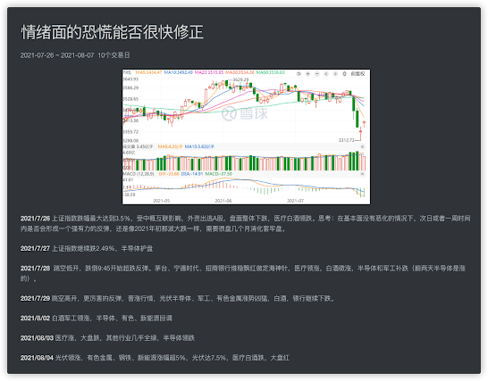

```javascript
/*
 * @Author: zendu 
 * @Date: 2021-08-26 15:11:12 
 * @Last Modified by: zendu
 * @Last Modified time: 2021-08-31 15:23:17
 */
```

### 什么样的交易逻辑？

```bash
「1」 顺大势、逆小势、反人性
「2」 任何人都可以在一定的时间内账面上出现浮盈，但这个浮盈就是最大的诱惑和陷阱。满仓浮盈空欢喜，未悟真经套中人
「3」纪律：重仓一只股，遇到其他趋势好的，做完这只的趋势再调仓！不要在亏损的时候卖出！ 什么时候该买？ 好的价格好的题材好的趋势
「4」 在觉得好的时候适当建仓，不要一直等合适的价格，比如煤炭钢铁有色
```


### 你能在股市中赚哪几种钱？

```bash
1. 周期股
2. 成长股
```


### 什么时候该进？什么时候该出？为什么赔钱？为什么而赚钱？该买什么类型的股？
```bash

卖之前好好想想，自己为什么要减仓或者清仓？

1. 因为买入的理由发生了变化？原来趋势好买入，现在趋势走坏卖出？
2. 达到自己的预期收益，选择卖出？
3. 发现更好的投资机会？有多好？

买之前好好想想，自己为什么要买？
1. 向上的趋势形成

为什么会赔钱？
1. 拿不住手里的股票，看到其他涨的好的，就盲目的追高。如果只是拿着自己的，很难跌的太多。


不买什么？
1. 势能不如同类ETF的股票，比如通信军工ETF涨的好的时候，北斗星通只涨一点点。
2. 处于下跌中继的股票，比如2021年8月的白酒、中概互联、医疗

买什么？
1. 重周期类型的，买供不应求的股票，比如2021年的锂矿、有色等。周期中供需决定一切。
2. 买趋势向上的股票，比如2021年8月份，南宁糖业月线级别趋势良好。资金为王，趋势不可违。「目前还在验证」
```


### 永远只持仓两只股！！！

```bash
「1」 持仓太多，没有那么多的精力管理，复盘的时候没办法研究每一只股票的涨跌原因

「2」 看盘的时候，感受市场和持仓股的走势势能，如果仓位分散，容易出现感知偏差，影响判断

「3」 分散的风险也是分散的收益，追求的是高风险高收益

「4」 遇到实在是觉得好的股票，选择其中两只可能是最完美的。如果无法判断，就多研究研究再判断，一定只能选两只。

「5」 那些同时持仓多只的，是能力不行。
```


### 利好消息？

高位释放利好消息可能是庄家借住利好消息出货，比如横盘的宁的时代，以及天地板的陆家嘴。低位相对安全。利好出尽就是利空，利空出尽就是利好。

### 关于做T？
```bash

「1」目前看来，每天看盘做T的并不可取。
「2」频繁的判断行情，容易受到市场上各种信息的感染，容易形成误判；
「3」来花费的时间成本太大，而提升自我有限。尝试过在南宁糖业、东方证券做T，有蝇头小利，但大涨的时候都卖飞了。
「4」水平确实不行，短线操作能力不足。

虽然不曾赚到，但也总结了些经验。大多数吃亏的时候都是涨了舍不得买，跌的狠了拿不住，于是成了任人宰割的韭菜。卖飞往往也会影响情绪，当人的情绪被影响到一个临界值，就会做出非理性的决策。
```


### 关于心理？

**频繁看盘** 损失厌恶感加强，导致情绪收到影响，继而影响判断

**冲高回落** 早上看盘最容易收到冲高回落的影响，往往在10:30左右到达最高点，收益满满，真正到了收盘的时候，却又没有太多，这种失落缓缓叠加，往往会造成不好的情绪，进而作出一些非理性的操作，增加被割的风险。

南宁糖业 8/19～8/23


### 关于A股为什么会出现暴涨暴跌？

因为A股没有做空机制，当股价上升的时候，只有不断推着它持续冲高才会赚到钱，此时全是做多的力量，自然就表现为暴涨。当达到一定阈值，庄家开始出逃，股价就会下跌，因为之前的涨幅违背了公司的基本面，所以下跌回调通常会幅度很大。

### 不合适的认知？

跳空回补是必要的吗？

跳空造成的压力位和支撑位是不是玄学问题？

跳空高开、跳空低开意味着什么？


盘面的轮动是否可预知？

中长线交易而言，轮动是否重要？

靠板块轮动炒股，是否可行？




