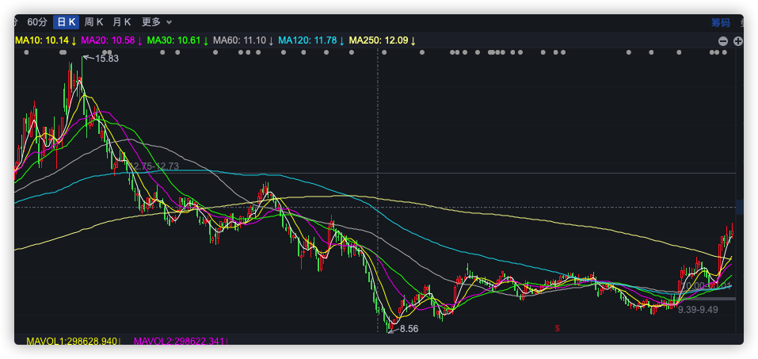
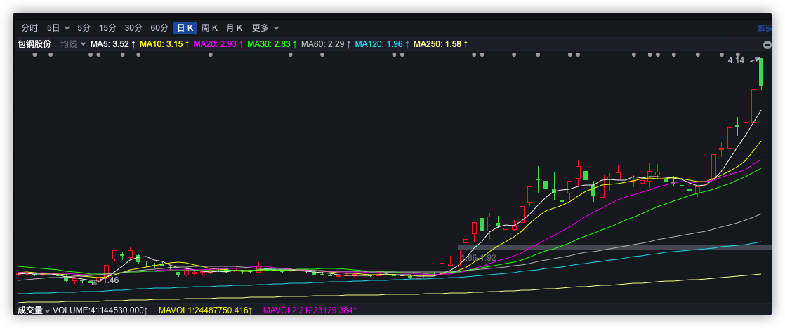

```js
/*
 * @Author: zendu 
 * @Date: 2021-08-31 15:37:22 
 * @Last Modified by:   zendu 
 * @Last Modified time: 2021-09-01 17:17:12 
 */
```


### 看K线买股是否合理？

之前买入南宁糖业，主要也是因为K线趋势形成 + 糖的周期性逐渐显现，买入后在11.80价格附近筑平台。那么如果每个人都知道周期股的存在，市场上岂不是很少有人亏钱了？比如牧原股份(猪肉周期)、中远海控(航运周期)、三一重工(基建周期)、片仔黄(中药周期)等等，倘若轮着周期来，岂不是很难亏钱。

目前买入(8/31)海格通信，也是看它K线趋势形成，在11.08附近筑平台，不知道未来走势会怎么样，倘若也是向南宁糖业那样，岂不是只需要根据K线买，根据K线买股就是根据资金买。资金为王、趋势不可违。以上趋势大概有以下几个特点：

1. 曾经有很高的高点，跌去了很大的估值
2. 横盘调整了很长时间
3. 低位放量突破，突破均线
4. 第一次放量之后打压，之后再次上攻，站上所有均线，然后横盘调整（也可能是出货）


<div align="center">

</div>


### 没有永远上涨的股票！

A股特色就是暴涨暴跌，看到涨上天的股票，韭菜往往会趋之若鹜。股票刚刚启动时，往往会涨的很慢，散户不容易发现，等到冲顶时，发出各种利好消息，甚至呈现出90度爬坡的K线，这时候散户往往会在犹犹豫豫中梭哈，然后山顶站岗，但只要记住，没有永远上涨的股票，只有永远保持冷静，才不会被市场的癫狂所影响。下图为2021/9/1日，包钢股份开盘涨停封单，盘中有色冲高后下跌至-7%，诱多的标准操作。


<div align="center">

</div>


### 内心不要存在妄想

刚开始入市的时候，常常会幻想永远上涨的股票，或者是下跌一段时间就立刻拉起来的，但从未根据事实进行判断过，罔顾K线等一系列技术指标，对基本面不闻不问，活在自己的主观臆测中幻想K线如何如何，最后通常是被套，然后内心语法烦躁，这算是最低级的股民。

炒股最重要的就是 格物、正心、诚意，即还原事物本来的样子、端正自己内心对于外物的看法摒弃所携带的利益，该如何就如何、通过前两点，以端正思想来炒股。也就是知行合一，正确的知 正确的行，不抱有任何幻想，自己推理得到的结论，就在行为上跟进。比如2021/9/1日观察到南宁糖业出现上吊线，并且在月线级别的高位，于是选择减仓1/2；观察券商处于低位，切下跌过三天，有色煤炭钢铁出货，大盘需要企稳，企稳需要券商拉盘，于是早盘开盘买入券商。


## 当前操作风格

1. 喜欢看趋势买股票：[南宁糖业、海格通信、三夫户外]
2. 喜欢找压力位和支撑位，在压力位/支撑位上买股票：[海格通信、三夫户外]
3. 害怕追高 -> 尝试追高 [天顺风能，特变电工，包钢股份，煤炭]
4. 不问投资逻辑即公司基本面